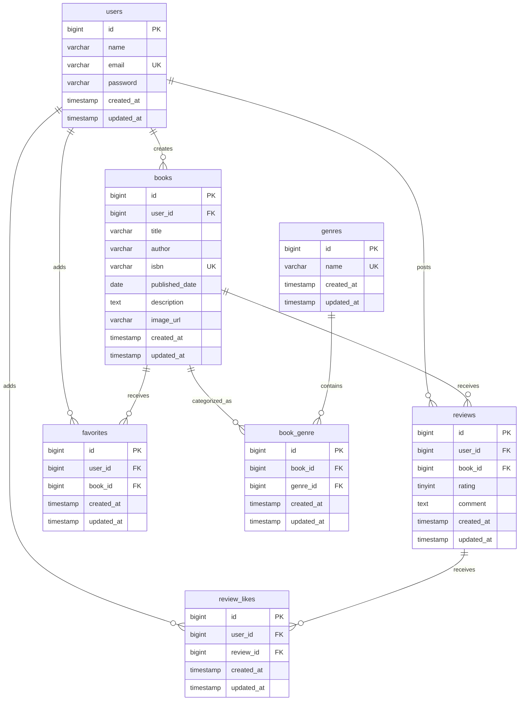

# BookShelf 書籍レビューアプリ

書籍の登録・閲覧、レビュー、お気に入り、ジャンル管理、評価ランキングを扱うLaravel製Webアプリケーションです。

現在はWeb画面の基本機能と公開APIを実装しています。機能テストの拡充、応用要件（検索・絞り込み・読書計画・通知など）は今後実装予定です。

## 実装済み機能

- 会員登録、ログイン、ログアウト
- 書籍の一覧・詳細表示
- 認証ユーザーによる書籍の登録・編集・削除
- 書籍と複数ジャンルの紐づけ
- レビューの投稿・編集・削除
- 1ユーザーにつき1書籍1件までのレビュー制御
- お気に入りの追加・解除と一覧表示
- レビューへのいいねの追加・解除
- ジャンルの一覧・詳細・登録・編集・削除
- レビュー平均評価による上位10冊のランキング表示
- 所有者だけが書籍・レビューを編集・削除できる認可
- FormRequestによる入力検証と日本語エラーメッセージ

## 未実装

- 公開APIのSanctum認証
- 機能テスト・単体テストの拡充
- キーワード検索、ジャンル絞り込み、並び替え
- ISBNによる書籍情報取得
- マイ読書レポート
- 読書計画・通知・日次バッチ処理

## 使用技術

| 分類 | 技術 |
|---|---|
| バックエンド | PHP 8.5 / Laravel 10.50.3 |
| 認証 | Laravel Fortify |
| データベース | MySQL 8.4 |
| フロントエンド | Blade / Vite 5 / Tailwind CSS 3.4 / Alpine.js |
| 開発環境 | Docker / Docker Compose / Laravel Sail |
| DB管理 | phpMyAdmin |
| コード整形 | Laravel Pint |

## ER図



複合ユニーク制約は次のとおりです。

- `book_genre`: `book_id`, `genre_id`
- `reviews`: `user_id`, `book_id`
- `favorites`: `user_id`, `book_id`
- `review_likes`: `user_id`, `review_id`

## 環境構築

Docker、Docker Composeが利用できる環境を前提とします。

```bash
git clone <repository-url>
cd bookshelf-app
cp .env.example .env
```

`.env` のデータベース設定を次のように変更します。

```dotenv
DB_CONNECTION=mysql
DB_HOST=mysql
DB_PORT=3306
DB_DATABASE=laravel
DB_USERNAME=sail
DB_PASSWORD=password
```

Docker経由で依存パッケージを準備した後、Sailを起動します。

```bash
docker run --rm \
    -u "$(id -u):$(id -g)" \
    -v "$(pwd):/var/www/html" \
    -w /var/www/html \
    laravelsail/php82-composer:latest \
    composer install --ignore-platform-reqs
./vendor/bin/sail up -d
./vendor/bin/sail artisan key:generate
./vendor/bin/sail npm install
./vendor/bin/sail npm run dev
```

別のターミナルで、テーブル作成と初期データ投入を実行します。

```bash
./vendor/bin/sail artisan migrate --seed
```

既存のデータベースを初期化して作り直す場合は、次のコマンドを使用します。この操作は既存データを削除します。

```bash
./vendor/bin/sail artisan migrate:fresh --seed
```

## URL

| 用途 | URL |
|---|---|
| アプリケーション | http://localhost |
| phpMyAdmin | http://localhost:8080 |

## 初期ユーザー

`./vendor/bin/sail artisan migrate --seed` の実行後、以下のユーザーでログインできます。パスワードは全ユーザー共通で `password` です。

| 名前 | メールアドレス |
|---|---|
| 山田太郎 | yamada@example.com |
| 鈴木花子 | suzuki@example.com |
| 田中一郎 | tanaka@example.com |
| 佐藤美咲 | sato@example.com |
| 高橋健太 | takahashi@example.com |

## Webルート概要

| 機能 | メソッド・パス |
|---|---|
| 書籍一覧 | `GET /`, `GET /books` |
| 書籍詳細 | `GET /books/{book}` |
| 書籍登録 | `GET /books/create`, `POST /books` |
| 書籍編集・削除 | `GET /books/{book}/edit`, `PUT /books/{book}`, `DELETE /books/{book}` |
| レビュー投稿 | `POST /books/{book}/reviews` |
| レビュー編集・削除 | `GET /reviews/{review}/edit`, `PUT /reviews/{review}`, `DELETE /reviews/{review}` |
| お気に入り | `GET /favorites`, `POST /books/{book}/favorites` |
| レビューいいね | `POST /reviews/{review}/like` |
| ジャンル管理 | `/genres` 以下のリソースルート |
| ランキング | `GET /ranking` |

## 公開API

書籍を扱う公開APIは認証なしで利用できます。

| メソッド | パス | 概要 |
|---|---|---|
| GET | `/api/v1/books` | 書籍一覧を取得 |
| GET | `/api/v1/books/{book}` | 書籍詳細を取得 |
| POST | `/api/v1/books` | 書籍を登録 |
| PUT | `/api/v1/books/{book}` | 書籍を更新 |
| DELETE | `/api/v1/books/{book}` | 書籍を削除 |

一覧APIでは、`keyword`、`genre_id`、`page`、`per_page`をクエリパラメータとして指定できます。`per_page`の初期値は20件、上限は100件です。

## コード整形

```bash
./vendor/bin/sail pint --test
```

自動整形を行う場合は次を実行します。

```bash
./vendor/bin/sail pint
```

## 作成者

南 雄大
