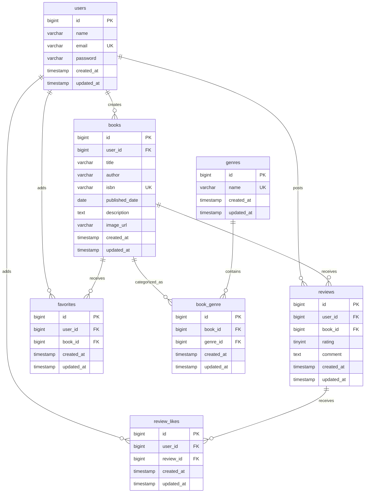
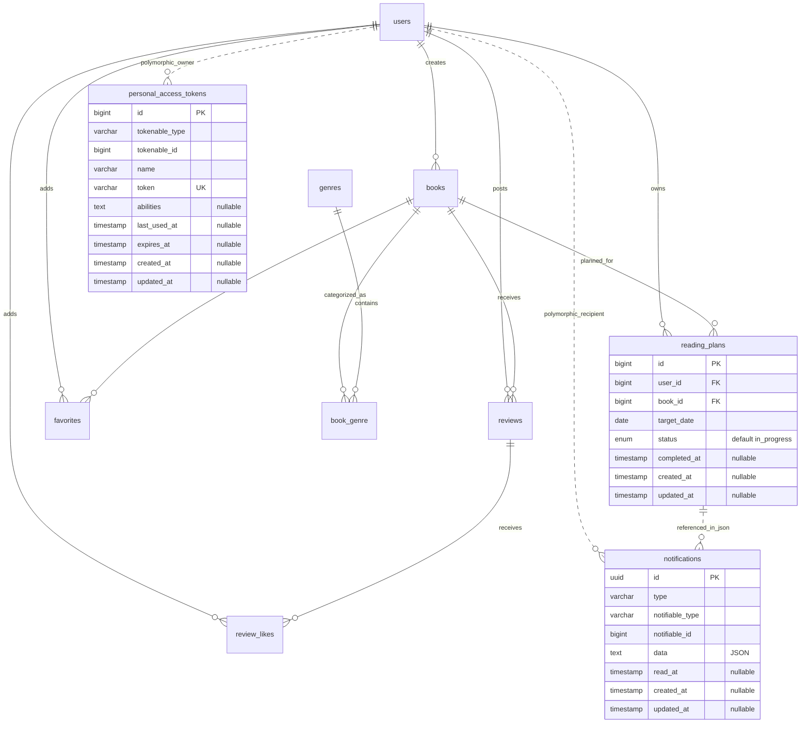

# BookShelf 書籍レビューアプリ

書籍の登録・閲覧、レビュー、お気に入り、ジャンル管理、評価ランキングを扱うLaravel製Webアプリケーションです。

現在はWeb画面の基本機能、書籍API、SanctumによるAPIトークン認証、および自動テストを実装しています。Web画面の検索・並び替え・ISBN検索にも対応しています。読書計画・リマインダー通知・日次バッチにも対応しています。

## 実装済み機能

- 会員登録、ログイン、ログアウト
- 書籍の一覧・詳細表示
- 認証ユーザーによる書籍の登録・編集・削除
- 書籍と複数ジャンルの紐づけ
- レビューの投稿・編集・削除
- 1ユーザーにつき1書籍1件までのレビュー制御
- お気に入りの追加・解除と一覧表示
- レビューへのいいねの追加・解除
- ジャンルの一覧・詳細・登録・編集・削除
- レビュー平均評価による上位10冊のランキング表示
- 所有者だけが書籍・レビューを編集・削除できる認可
- FormRequestによる入力検証と日本語エラーメッセージ
- SanctumのBearerトークンによるAPI認証・トークン発行と失効
- PHPUnitによる基本機能と応用API認証の自動テスト

- Web書籍一覧のタイトル・著者検索、ジャンル絞り込み、4種類の並び替え
- Google Books APIによるISBN-13検索と登録フォームへの自動入力
- 本人のレビューを集計するマイ読書レポート

- 読書計画の登録・期日変更・読了・削除・状態による絞り込み
- リマインダー通知の一覧・既読管理、毎日20:00の期限切れ更新と通知処理

## 使用技術

| 分類 | 技術 |
|---|---|
| バックエンド | PHP 8.5 / Laravel 10.50.3 |
| 認証 | Laravel Fortify / Laravel Sanctum |
| データベース | MySQL 8.4 |
| フロントエンド | Blade / Vite 5 / Tailwind CSS 3.4 / Alpine.js |
| 開発環境 | Docker / Docker Compose / Laravel Sail |
| DB管理 | phpMyAdmin |
| コード整形 | Laravel Pint |

## 応用フェーズ移行準備

読書計画・通知テーブルは追加マイグレーションで作成します。既存環境ではマイグレーションの適用が必要です。

## 基本機能のER図



複合ユニーク制約は次のとおりです。

- `book_genre`: `book_id`, `genre_id`
- `reviews`: `user_id`, `book_id`
- `favorites`: `user_id`, `book_id`
- `review_likes`: `user_id`, `review_id`

## 応用機能のER図

既存の基本テーブルに以下の関連とテーブルを追加しています。books.isbn・published_dateはNULLを許可します。



破線は通常の外部キーを設定しない関連を表します。notificationsはLaravelのポリモーフィック関連、計画IDはdata内の論理参照です。計画と関連通知の削除はアプリケーションの同一トランザクションで処理します。personal_access_tokensは既存テーブルです。

## 環境構築

Docker、Docker Composeが利用できる環境を前提とします。

```bash
git clone https://github.com/minami355/bookshelf-app.git
cd bookshelf-app
cp .env.example .env
```

`.env.example`にはSail用の次のデータベース設定が含まれています。コピー後の`.env`が同じ内容になっていることを確認してください。MySQL 8.4では`DB_USERNAME`に`root`を指定せず、Laravel接続用の一般ユーザーを使用します。

```dotenv
DB_CONNECTION=mysql
DB_HOST=mysql
DB_PORT=3306
DB_DATABASE=laravel
DB_USERNAME=sail
DB_PASSWORD=password
```

Docker経由で依存パッケージを準備した後、Sailを起動します。ここで使用する`laravelsail/php82-composer`は、初回の`composer install`でSailを導入するための一時的なComposer実行環境です。アプリケーション本体は`compose.yaml`で定義されたPHP 8.5のSailコンテナ上で動作します。

```bash
docker run --rm \
    -u "$(id -u):$(id -g)" \
    -v "$(pwd):/var/www/html" \
    -w /var/www/html \
    laravelsail/php82-composer:latest \
    composer install --ignore-platform-reqs
./vendor/bin/sail up -d
```

毎回`./vendor/bin/sail`と入力せず、`sail`だけでコマンドを実行したい場合は、Sail起動後に次のエイリアスを設定します（zshの場合）。

```bash
echo 'alias sail="[ -f sail ] && bash sail || bash vendor/bin/sail"' >> ~/.zshrc
source ~/.zshrc
```

設定後、アプリケーションキーの生成とフロントエンドのセットアップを行います。新規clone直後はViteのbuild成果物が存在しないため、Feature Testを実行する前に`npm run build`を実行してください。開発中にViteの開発サーバーを使用する場合は、別途`npm run dev`を起動します。

```bash
sail artisan key:generate
sail npm install
sail npm run build
```

```bash
# 開発中のみ（常駐プロセス）
sail npm run dev
```

エイリアスを設定しない場合は、`sail`を`./vendor/bin/sail`に読み替えて実行してください。

別のターミナルで、テーブル作成と初期データ投入を実行します。

```bash
./vendor/bin/sail artisan migrate --seed
```

既存のデータベースを初期化して作り直す場合は、次のコマンドを使用します。この操作は既存データを削除します。

```bash
./vendor/bin/sail artisan migrate:fresh --seed
```

## URL

| 用途 | URL |
|---|---|
| アプリケーション | http://localhost |
| phpMyAdmin | http://localhost:8080 |

## 初期ユーザー

`./vendor/bin/sail artisan migrate --seed` の実行後、以下のユーザーでログインできます。パスワードは全ユーザー共通で `password` です。

| 名前 | メールアドレス |
|---|---|
| 山田太郎 | yamada@example.com |
| 鈴木花子 | suzuki@example.com |
| 田中一郎 | tanaka@example.com |
| 佐藤美咲 | sato@example.com |
| 高橋健太 | takahashi@example.com |

## Webルート概要

| 機能 | メソッド・パス |
|---|---|
| 書籍一覧 | `GET /`, `GET /books` |
| 書籍詳細 | `GET /books/{book}` |
| 書籍登録 | `GET /books/create`, `POST /books` |
| 書籍編集・削除 | `GET /books/{book}/edit`, `PUT /books/{book}`, `DELETE /books/{book}` |
| レビュー投稿 | `POST /books/{book}/reviews` |
| レビュー編集・削除 | `GET /reviews/{review}/edit`, `PUT /reviews/{review}`, `DELETE /reviews/{review}` |
| お気に入り | `GET /favorites`, `POST /books/{book}/favorites` |
| レビューいいね | `POST /reviews/{review}/like` |
| ジャンル管理 | `/genres` 以下のリソースルート |
| ランキング | `GET /ranking` |
| マイ読書レポート（認証必須） | `GET /reports` |

## マイ読書レポート（Issue #12）

ログイン後、`/reports`で本人が投稿した全期間のレビューを確認できます。未ログインの場合はログイン画面へ移動します。

- 基本統計：総レビュー数、レビューした書籍のユニーク件数、平均評価（小数第1位）。レビューがない場合は件数0、平均評価は`null`として画面では`-`を表示します。
- 評価分布：1〜5の各件数を横棒で表示します。該当するレビューがない評価も0件で表示します。
- 高評価書籍TOP5：本人の評価が4以上の書籍を評価の高い順に最大5件表示します。同評価ではレビュー投稿日が新しい順とし、書籍詳細へ移動できます。
- ジャンル別評価傾向TOP5：本人のレビューの平均評価が高い順、同平均ではレビュー件数が多い順に最大5件表示します。複数ジャンルの書籍は各ジャンルで集計し、ジャンル詳細へ移動できます。

読了冊数はレビューした書籍を基準とし、読書計画の完了件数は含めません。月別集計は対象外です。既存のレポート用Bladeを利用し、集計クエリと書籍のEager Loadingでデータを取得します。

レポートのテストは`./vendor/bin/sail artisan test --filter=ReadingReportTest`で実行できます。本人以外のレビューの除外、全期間集計、空の状態、順位・同率時の順序、最大5件、複数ジャンル、未認証時のリダイレクトを検証します。

## 書籍の検索・ソート・ISBN検索（Issue #11）

`GET /books`（トップ画面 `/` も同様）はゲストでも利用できます。

- `keyword`：前後の空白を除去し、タイトルまたは著者を部分一致で検索します。空の場合は検索条件を追加しません。
- `genre_id`：既存ジャンルIDで絞り込みます。未指定は全ジャンル、不正なIDは日本語の入力エラーとして元の画面へ戻します。
- `sort`：`latest`（登録の新しい順）、`oldest`（古い順）、`title`（タイトル昇順）、`rating`（平均評価の高い順）。未指定・不正値は`latest`です。
- 評価が同じ場合は登録の新しい順、レビューなしの書籍は評価順の最後に表示します。
- 条件は組み合わせ可能で、1ページ10件。ページ移動後も`keyword`・`genre_id`・`sort`を保持します。

ログイン後、書籍登録画面の「ISBN から書籍情報を自動入力」で13桁の半角数字を入力します。`GET /books/isbn/{isbn}`がGoogle Books APIへ問い合わせ、タイトル・著者・出版日・説明・画像URLをフォームに反映します。通信処理は`GoogleBooksService`に分離しています。

検索だけではDBに保存されません。ISBNは検索に使った値を設定し、取得できなかった項目は入力済みの値を保持します。出版日が年だけ・年月だけの場合は日付を補わず、現在の入力を保持します。取得後も全項目を編集してから通常の登録ができます。Web登録・編集でもISBN・出版日は任意入力です。

| 結果 | HTTPステータス |
|---|---|
| 取得成功 | 200 |
| 該当なし | 404 |
| ISBN形式不正 | 422 |
| Google BooksのHTTPエラー・タイムアウト・不正レスポンス | 502 |

Google Books APIを有効にしたプロジェクトのAPIキーを、サーバーの`.env`へ設定してください。キーはブラウザーに渡しません。[Google Books公式の認証・APIキー説明](https://developers.google.com/books/docs/v1/using#auth)

```dotenv
GOOGLE_BOOKS_API_KEY=取得したAPIキー
```

設定をキャッシュしている場合は`./vendor/bin/sail artisan config:clear`を実行してください。通信の接続タイムアウトは3秒、全体のタイムアウトは10秒です。

## 読書計画・リマインダー（Issue #13）

ログイン後、`/reading-plans`で本人の計画を期日の昇順に10件ずつ表示します。状態は`in_progress`（読書中）・`completed`（読了）・`expired`（期限切れ）です。未指定は全状態、不正な状態は日本語の入力エラーになります。

- 登録：存在する書籍と当日以降の期日を指定します。状態と所有者はサーバー側で設定します。
- 重複制御：同じユーザー・同じ書籍の読書中の計画がある場合は登録・更新できません。更新時は対象自身を除外します。
- 編集：本人の読書中・期限切れの計画のみ期日を変更できます。期限切れの計画は読書中へ戻ります。読了済みの編集・更新は403です。
- 読了：読書中・期限切れを読了へ変更し、完了日時を保存します。再操作では完了日時を変更しません。
- 削除：計画と関連通知を同じトランザクションで物理削除します。
- 認可：他人の計画への操作は403、存在しない計画は404です。未ログインではログイン画面へ移動します。
- 通知：`/notifications`で本人の通知を新しい順に20件ずつ表示します。本人の通知のみ既読にでき、再操作はエラーにしません。

日次コマンドは`reading-plans:remind`です。Asia/Tokyoの当日を基準に、まず期日が今日より前の読書中の計画を期限切れへ変更し、その後に通知します。

| 通知 | 状態 | 期日 |
|---|---|---|
| 期日3日前 | in_progress | 3日後 |
| 期日当日 | in_progress | 当日 |
| 期日3日後 | expired | 3日前 |

通知はLaravel標準のDatabase Notificationに保存します。登録・期日変更では作成せず、バッチのみで作成します。読了済み・削除済みの計画は対象外です。同一計画・同一通知種別は、既読や期日変更後も重複作成しません。

### 環境への反映と動作確認

追加テーブルを作成します。既存データを削除する操作ではありません。

```bash
./vendor/bin/sail artisan migrate
```

新規DBへの通常のシード投入では、BookSeederは登録者をランダムに割り当て、ReviewSeederは各書籍2〜4件・評価1〜5・評価別日本語コメント・異なるランダムな投稿者を使用します。ReadingPlanSeederは山田太郎に5件、鈴木花子に1件、合計6件を`Carbon::today('Asia/Tokyo')`基準で作成します。各計画には異なる書籍を割り当てます。

| 計画ID（新規DB） | ユーザー | 期日 | 状態 |
|---|---|---|---|
| 1 | 山田太郎 | 3日後 | in_progress |
| 2 | 山田太郎 | 当日 | in_progress |
| 3 | 山田太郎 | 3日前 | in_progress |
| 4 | 山田太郎 | 7日後 | in_progress |
| 5 | 山田太郎 | 10日前 | completed（完了日時は5日前） |
| 6 | 鈴木花子 | 5日後 | in_progress |

Seederは空のDBへの初回投入を前提とします。既存データがある環境での再投入は行わないでください。既存ユーザー・書籍があり読書計画が未投入の場合は、`./vendor/bin/sail artisan db:seed --class=ReadingPlanSeeder`で計画のみ投入できます（IDは既存データに依存します）。

```bash
# 手動実行：期限切れ更新と通知を作成
./vendor/bin/sail artisan reading-plans:remind
# スケジュールの確認
./vendor/bin/sail artisan schedule:list
# 開発環境でスケジューラーを常駐実行
./vendor/bin/sail artisan schedule:work
```

日次コマンドは毎日20:00（Asia/Tokyo）に設定しています。自動実行には稼働中のSchedulerが必要です。本番では毎分`php artisan schedule:run`を実行するcronなどを設定してください。

シード当日に手動実行すると計画3がexpiredになり、計画1・2・3に各1件の通知が作成されます。再実行しても同じ通知は増えません。山田太郎で`/reading-plans/6/edit`を開くと403になります（新規DBの場合）。

今回、既存Bladeに一覧のページ移動リンク・状態エラー表示・通知から読書計画へのリンクを追加しています。

応用Seeder、通知の重複防止、所有者認可、日次スケジュールは自動テストの対象です。開発用DBへのマイグレーション・シード投入、常駐Schedulerの起動確認とは分けて検証します。

## 公開API

GETの書籍一覧・詳細は認証不要です。書き込みAPIには `Authorization: Bearer <token>` を指定します。更新・削除はBookPolicyにより所有者だけに許可します。更新時は入力検証より先に所有者を確認します。

| メソッド | パス | 概要 | 認証 | 成功時 |
|---|---|---|---|---|
| GET | `/api/v1/books` | 書籍一覧を取得 | 不要 | 200 |
| GET | `/api/v1/books/{book}` | 書籍詳細を取得 | 不要 | 200 |
| POST | `/api/v1/books` | 書籍を登録 | Bearerトークン | 201 |
| PUT | `/api/v1/books/{book}` | 書籍を更新 | Bearerトークン・所有者 | 200 |
| DELETE | `/api/v1/books/{book}` | 書籍を削除 | Bearerトークン・所有者 | 204（本文なし） |
| POST | `/api/v1/tokens` | トークンを発行 | メールアドレス・パスワード | 200 |
| DELETE | `/api/v1/tokens/current` | 使用中のトークンを失効 | Bearerトークン | 204（本文なし） |

トークン発行には `email`・`password`・`device_name` が必須です。成功時は `{"token":"..."}` を返します。認証情報の不一致は401、入力不備は422です。失効したトークンで認証必須APIにアクセスすると401になります。他の端末のトークンは失効しません。

一覧APIでは、`keyword`（タイトル・著者・ISBNの部分一致）、`genre_id`、`page`、`per_page`を指定できます。登録日時の新しい順に返し、`per_page`は初期値20件、1〜100件です。API Resourceでジャンル・平均評価・レビュー件数を返し、詳細にはレビューも含めます。

登録・更新は `title`・`author`・`genre_ids` が必須です。`genre_ids`は既存ジャンルIDを1件以上含む、重複のない配列です。`isbn`・`published_date`・`description`・`image_url` は任意入力で、`null`を許可します。ISBNは入力時13桁・一意（更新対象自身を除外）、出版日は有効な日付、画像URLは有効なURLとして検証します。PUTは全項目更新とし、省略された任意項目も`null`に更新します。登録者は変更しません。

登録者は認証ユーザーに固定され、送信された`user_id`は使用しません。更新時も登録者は変更しません。書籍の保存とジャンル同期はトランザクション内で実行します。書籍削除時はレビュー・いいね・お気に入り・ジャンルとの紐づけを削除し、ジャンル自体は残します。

APIのエラーは`Accept`ヘッダーの有無にかかわらずJSONで返します。

| ステータス | 条件 |
|---|---|
| 401 | 未認証・無効または失効済みトークン・ログイン情報不一致 |
| 403 | 所有者以外による更新・削除 |
| 404 | 対象の書籍が存在しない |
| 422 | 入力検証エラー（日本語メッセージ） |

書籍が存在しない場合、GET・PUT・DELETEともに `{"error":"書籍が見つかりませんでした。"}` を返します。認証必須APIでは未認証の401を先に判定します。

ISBN・出版日のnullable化には追加マイグレーションを使用します。環境更新時は`composer install`と`php artisan migrate`を実行してください（Sail環境ではそれぞれ`./vendor/bin/sail composer install`・`./vendor/bin/sail artisan migrate`）。SQLiteでのカラム変更に必要なDoctrine DBALも依存関係に含めています。

## テスト

テストではSQLiteのインメモリデータベースと`RefreshDatabase`を使用します。開発用のMySQLデータベースとは分離され、テストごとに独立した状態で実行されます。

基本機能と応用APIについて、次の機能を検証しています。

- モデルとリレーション
- 会員登録、ログイン、ログアウト
- ゲストと認証ユーザーの画面アクセス制御
- 書籍のCRUD、入力検証、所有者認可、関連データ削除
- レビューのCRUD、入力検証、重複投稿防止、投稿者認可
- ジャンルのCRUD、入力検証、書籍との紐づけ、削除制限
- お気に入りとレビューいいねの追加・解除・重複防止
- 平均評価とレビュー件数によるランキング
- 公開APIのCRUD、検索、絞り込み、ページネーション、JSONレスポンス
- トークン発行・失効、認証必須、所有者認可、登録者の改ざん防止、任意入力
- AcceptヘッダーなしでのJSONエラー返却
- HTTPステータス`200`、`201`、`204`、`401`、`403`、`404`、`422`

すべてのテストを実行するには、次のコマンドを使用します。

```bash
./vendor/bin/sail artisan test
```

ISBNフォームのJavaScriptテストは次のコマンドで実行します。

```bash
./vendor/bin/sail node --test tests/js/isbn-form.test.cjs
```

カバレッジを確認する場合は、次のコマンドを使用します。

```bash
./vendor/bin/sail artisan test --coverage
```

Google Books APIはHTTPモックで正常応答・該当なし・通信失敗を検証しています。実APIとの疎通や開発用MySQLの変更は行いません。

### 応用機能テスト（2026-09-30）

要件シートとタスクの順序に沿い、既存テストの確認と不足ケースの追加を行いました。

| 順序 | タスク | 対応するFeature Test |
|---|---|---|
| 1 | Sanctumトークン認証 | `Api/V1/ApiAuthenticationTest.php`：公開GET、未認証401、トークン発行・BearerでCRUD・失効後の拒否 |
| 2 | 認証付き書籍CRUD API | `Api/V1/BookApiTest.php`：201・200・204、JSON、DB保存・更新・削除、入力不正422 |
| 3 | APIの認可・BookPolicy | `Api/V1/ApiAuthenticationTest.php`：所有者以外403とデータ保持、存在しない書籍404。Web側は`BookCrudTest.php`・`BookAccessTest.php`で検証 |
| 4 | 検索・絞り込み・ソート | `BookSearchTest.php`：タイトル・著者の部分一致、ジャンル、複合条件、該当なし、2ページ目の条件保持、4種類の順序、同評価・レビューなし・不正sort |
| 5 | Google Books API・ISBN検索 | `IsbnBookTest.php`：Http::fake()による取得内容、422・404・502、検索のみではDB保存しないこと |
| 6 | マイ読書レポート | `ReadingReportTest.php`：本人の集計、冊数・件数・平均・評価分布、書籍とジャンルの上位5件、データなし。月別集計は対象外 |
| 7 | 読書計画CRUD・Enum・Policy | `ReadingPlanTest.php`：各状態の絞り込み、重複制限と再登録、読了日時、所有者制限、期日変更、過去日拒否、completedの編集・更新403 |
| 8 | リマインダーCommand・通知 | `ReadingPlanTest.php`：毎日20:00 Asia/Tokyoの設定、失効後の通知判定、3種類の通知、対象外、本人の一覧・既読・他人の通知403 |
| 9 | 状態遷移・重複通知・全体テスト | `ReadingPlanTest.php`：当日・未来日・completed・expiredの保持、再実行時の重複防止、計画削除失敗時の関連通知ロールバック。基本機能を含む全テストを実行 |

他人の通知を既読にする操作は要件に合わせて403へ修正しました。存在しない通知は404です。

### 最新検証結果（2026-10-04）

- PHPテスト：**99件・709アサーション成功**
- コードカバレッジ：**93.3%**
- ISBNフォームのJavaScriptテスト：**3件成功**
- Laravel Pint：**137ファイル合格**

PHPテストはSQLiteインメモリDBを使用し、Google Books APIへの実通信は行っていません。Schedulerは設定をテストしており、常駐プロセスの稼働確認とは別です。

## コード整形

```bash
./vendor/bin/sail pint --test
```

自動整形を行う場合は次を実行します。

```bash
./vendor/bin/sail pint
```

## 作成者

南 雄大
